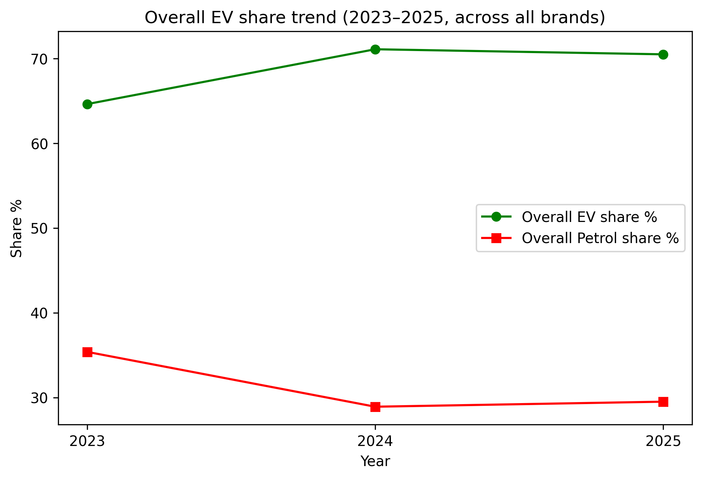
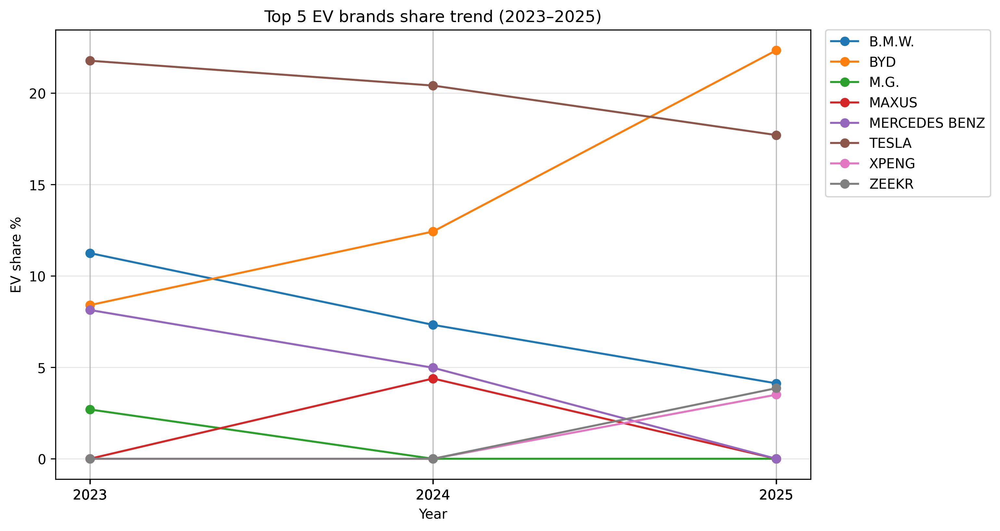
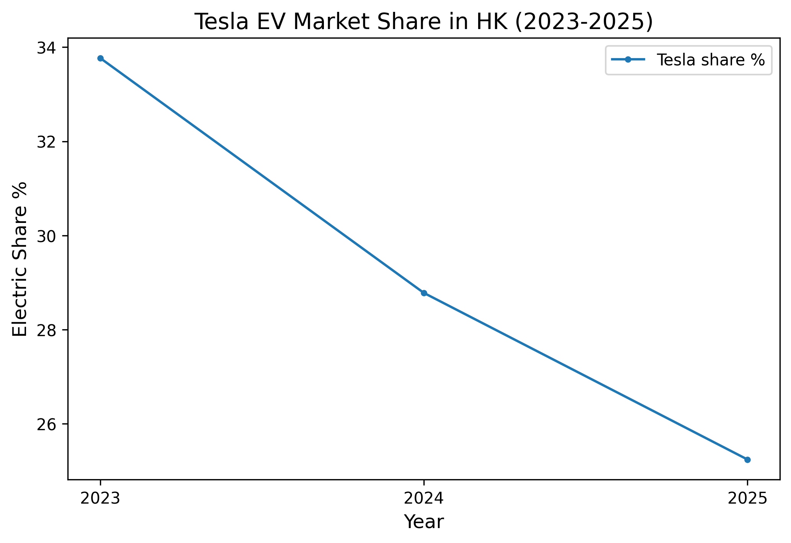

# 🚗 Hong Kong EV Market Analysis (2023–2025 H1)

This project analyzes the adoption of **Electric Vehicles (EVs)** in Hong Kong using official car registration data (2023–June 2025).  
It explores overall EV vs Petrol trends, leading brands, and competition dynamics in the local market.  

---

## 📊 Dataset
- Source: Publicly available vehicle registration statistics (HK Government)  
- Coverage: 2023–June 2025  
- Key Columns: `Year`, `Brand`, `EV`, `Petrol`, `Others`, `Total`  

---

## 🔎 Analysis Highlights
1. **Overall Market Trend**  
   - EV share increased from ~65% (2023) to over 70% by **mid-2025**.  
   - Petrol vehicles continued to decline, showing irreversible EV adoption.  

  

2. **Top 5 EV Brands (2023–2025 H1)**  
   - **BYD**: Strong growth, from ~9% → 22%, emerging as the biggest winner.  
   - **Tesla**: Gradual decline, from ~22% → 18%, losing part of its early lead.  
   - **B.M.W. / Mercedes-Benz**: Downward trend, showing slower EV adoption.  
   - **Newcomers (XPENG, ZEEKR, etc.)**: Small base but visible momentum by 2025.  

   

3. **Case Study: Tesla**  
   - Despite overall EV market expansion, Tesla’s share **fell from ~34% to 25%**.  
   - Competition is intensifying—Tesla is no longer the sole leader in Hong Kong.  

  

---

## 📌 Conclusion
- EV adoption in Hong Kong is **accelerating and irreversible**.  
- **BYD** shows the fastest growth and strongest competitive edge.  
- **Tesla** faces growing competition despite early dominance.  
- Luxury incumbents (B.M.W., Mercedes) are losing share to Chinese EV leaders and newcomers.  

---

## 🛠️ Tech Stack
- **Python (Pandas, Matplotlib)** for data processing & visualization  
- **Jupyter Notebook** for analysis  
- **GitHub** for version control & project sharing  

---

## 📂 Project Structure
